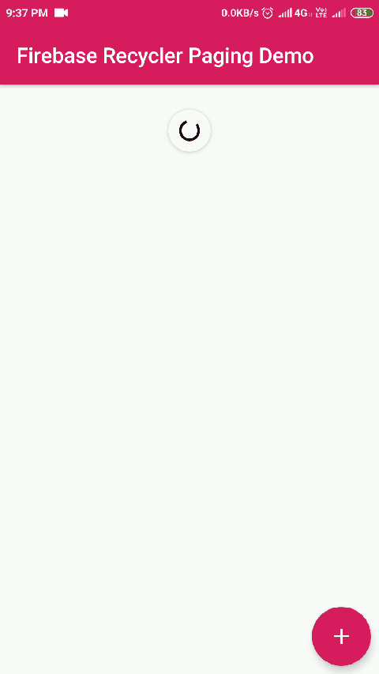

# Sample App (Using FirebaseRecyclerPagination Library)
Here is sample app demonstrating features of FirebaseRecyclerPagination library.
Output will be as following GIF.

## Getting Started

### Maven
```maven
    repositories {
        jcenter()
    }
```
### Gradle
```groovy
dependencies {
    //Android Paging Libray
    implementation "android.arch.paging:runtime:1.0.1"
    
    //Firebase Pagination Library
    implementation 'com.shreyaspatil:FirebaseRecyclerPagination:0.5-beta'
}
```
### App
In this app, you are showing paginated list of Posts. Posts will load in RecyclerView
#### Data Model Class (Post.class)
```java
public class Post {
    public String title;
    public String body;

    public Post(){}

    public Post(String title, String body) {
        this.title = title;
        this.body = body;
    }
}
```

### MainActivity.java

#### Declarations
```java
public class MainActivity extends AppCompatActivity {

    private RecyclerView mRecyclerView;
    private DatabaseReference mDatabase;

    FirebaseRecyclerPagingAdapter<Post, ItemViewHolder> mAdapter;
```

#### Initialization
```java
   @Override
       protected void onCreate(Bundle savedInstanceState) {
           super.onCreate(savedInstanceState);
           setContentView(R.layout.activity_main);
   
           //Initialize RecyclerView
           mRecyclerView = findViewById(R.id.recycler_view);
           mRecyclerView.setHasFixedSize(true);
           mRecyclerView.setLayoutManager(new LinearLayoutManager(this));
   
           //Initialize Database
           mDatabase = FirebaseDatabase.getInstance().getReference().child("posts");

```

#### Setup Configuration for PagedList
First of all configure PagedList
```java
        PagedList.Config config = new PagedList.Config.Builder()
                .setEnablePlaceholders(false)
                .setPrefetchDistance(5)
                .setPageSize(10)
                .build();
```

Then Configure Adapter by building FirebasePagingOptions. It will generic.
```java
FirebasePagingOptions<Post> options = new FirebasePagingOptions.Builder<Post>()
                .setLifecycleOwner(this)
                .setQuery(mDatabase, config, Post.class)
                .build();
```
#### Init Adapter
FirebasePagingAdapter is built on the top of Android Architecture Components - Paging Support Library.
To implement, you should already have ViewHolder subclass. Here We used ItemViewHolder class.
```java
        mAdapter = new FirebaseRecyclerPagingAdapter<Post, ItemViewHolder>(options) {
            @NonNull
            @Override
            public ItemViewHolder onCreateViewHolder(@NonNull ViewGroup parent, int viewType) {
                return new ItemViewHolder(LayoutInflater.from(parent.getContext()).inflate(R.layout.item_list, parent, false));
            }
    
            @Override
            protected void onBindViewHolder(@NonNull ItemViewHolder holder, int position, @NonNull Post model) {
                holder.setItem(model);
            }
        };
```

#### Set Adapter
Finally, Set adapter to RecyclerView.
```java
        mRecyclerView.setAdapter(mAdapter);
```

#### Listener for Paging events
This is optional. After setting up the StateChangedListener it will respond to changes in RecyclerView events.
```java
        mAdapter.setStateChangedListener(new StateChangedListener() {
               @Override
               public void onInitLoading() {
                   //First Time Loading. Do Animation
               }
        
               @Override
               public void onLoading() {
                   //When Loading Every Time. Do Animation
               }
        
               @Override
               public void onLoaded() {
                   //When Items are loaded in RecyclerView
               }
        
               @Override
               public void onFinished() {
                   //When Items are fully loaded. List Ends.
               }
        
               @Override
               public void onError() {
                   //When Error is Occured.
               }
           });
```

#### Lifecycle
At last, To begin populating data, call startListening() method. stopListening() stops the data being loaded.
```java
//Start Listening Adapter
    @Override
    protected void onStart() {
        super.onStart();
        mAdapter.startListening();
    }

    //Stop Listening Adapter
    @Override
    protected void onStop() {
        super.onStop();
        mAdapter.stopListening();
    }
```
Thus, we have implemented Firebase Recycler Pagination.
Thank You !

